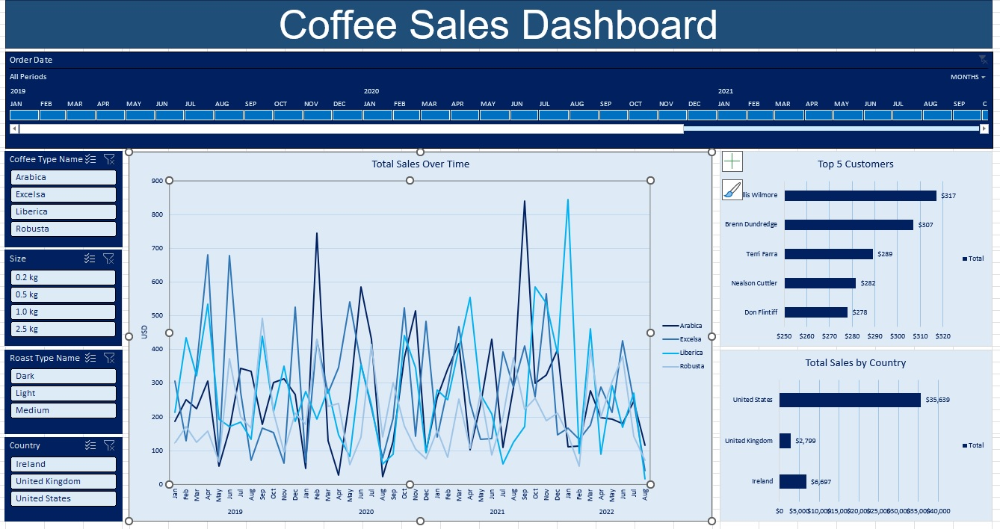

# Coffee Sales Data Analysis

## Objectives
The primary objective of this project is to demonstrate proficiency in data analytics and business intelligence. The focus is on real-world data analysis scenarios in the sales domain, from raw data processing to insightful visualizations.

## Summary
This project involves a deep dive into coffee sales data. Using various Excel tools and techniques, the raw sales data was cleaned, transformed, and analyzed. The results are presented in a comprehensive dashboard that highlights key metrics and trends, offering invaluable insights for decision-makers in the sales and marketing domains.

## Dataset
The dataset, `CoffeeOrdersDataset.xlsx`, contains raw sales data, including order IDs, order dates, customer IDs, product IDs, and quantities.

## Analysis & Transformation
Processed and analyzed data is presented in `Coffee Orders Data Analysis + Vis.xlsx`. Key features and transformations include:
- **Data Cleaning & Merging**: Missing values in the raw dataset were addressed. Additional customer and product details were integrated using their respective IDs.
- **Data Segmentation**: Data was segmented by various attributes, such as country and customer ID.
- **Pivot Tables**: Created to offer summaries like total sales by date and coffee type and sales by country.
- **Ranking**: Identified the top 5 customers based on sales.

## Dashboard Visualizations
The 'Dashboard' sheet provides a visual representation of the analyzed data. Highlights include:
- **Time-Series Line Chart**: Showcasing sales trends over months.
- **Bar Charts**: Possibly representing sales by product type or region.
- **Pie Charts**: Illustrating sales distribution, potentially by region or product type.
- **Tables**: Offering detailed data alongside visualizations for comprehensive insights.
- **KPIs or Metrics**: Quick insights into figures like total sales, average sales, or growth percentage.

## Tools & Techniques
This analysis utilizes advanced features in Excel, including data cleaning, transformation tools, pivot table creation, data summarization, and visualization tools.
